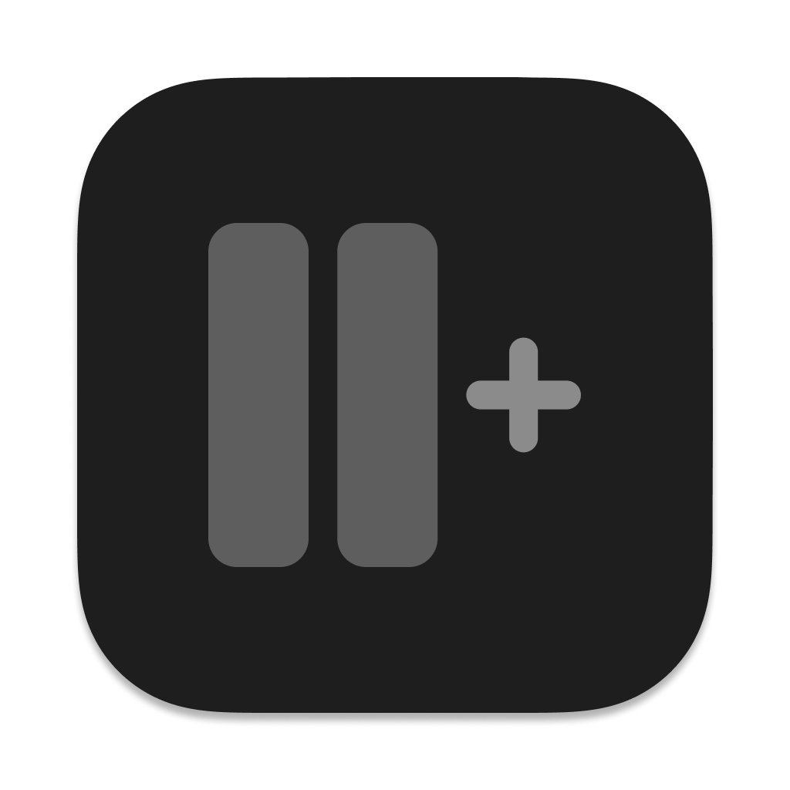

# Muxt

<p align="center">
  
</p>

<p align="center">
  <strong>Multi-column social media viewer for desktop.</strong>
</p>

<p align="center">
  <a href="https://github.com/sil-so/muxt/releases">Download Latest Release</a>
  ·
  <a href="#features">Features</a>
  ·
  <a href="#development">Development</a>
</p>

https://github.com/user-attachments/assets/633ae1c6-a363-4da6-9f56-a64e20ea1b93

**Muxt** was built to solve a specific workflow friction: the constant context-switching required to keep up with curated accounts across platforms.

For developers and creatives who use social media to track resources, news, and design inspiration, Muxt offers a cleaner, more efficient alternative. It unifies your feeds side-by-side, removes visual clutter, and provides tools like synchronized scrolling, dimmable columns and grayscale mode to make checking your feeds faster and less distracting.

## Features

🧩 **Multi-column View** - Monitor X, LinkedIn, Bluesky, Threads, and Reddit simultaneously in a single window.
🎨 **Grayscale Mode** - Optional monochrome filter to reduce visual stimulation and focus purely on information.
🎯 **Focus Mode** - Automatically dims unfocused columns to minimize peripheral distractions while reading.
🛡️ **Ad & Tracker Blocking** - Integrated Ghostery engine for a cleaner, faster, and more private experience.
🔄 **Smart Scroll Sync** - Scroll all feeds in unison. Sync automatically pauses when interacting with a specific post to prevent layout jumps.
🧱 **Customizable Layouts** - Drag-and-drop to reorder, resize columns, or toggle specific platforms on or off. Preferences persist between sessions.
🌐 **Default Browser Support** - External links are opened in your default OS browser.

## Supported Platforms

| Platform | URL |
|----------|-----|
| X (Twitter) | x.com |
| LinkedIn | linkedin.com |
| Bluesky | bsky.app |
| Threads | threads.net |
| Reddit | reddit.com |


## Installation

### Download

Get the latest macOS version from the [GitHub Releases](https://github.com/sil-so/muxt/releases) page.

**Windows & Linux:** Builds are available in the releases, but have not yet been tested. If you encounter OS-specific issues, please create an Issue.

### macOS Setup

1. Download `Muxt-x.x.x-mac.zip`.
2. Extract the archive and move `Muxt.app` to your Applications folder.
3. **Note:** As this is an open-source project without an Apple Developer signature, you must run the following command in Terminal to bypass the quarantine flag:
   ```bash
   xattr -cr /Applications/Muxt.app
   ```
4. Open Muxt.

## Development

Muxt uses Docker to ensure a consistent, isolated development environment.

### Prerequisites

- [Docker](https://www.docker.com/get-started) and Docker Compose
- Node.js 20+ (Required only for local non-Docker development)

### Quick Start

```bash
# Clone the repository
git clone https://github.com/sil-so/muxt.git
cd muxt

# Install dependencies (via Docker container)
docker-compose run --rm app npm install

# Start development server
docker-compose run --rm -p 5173:5173 app npm run dev
```

### Build & Test

```bash
# Run test suite
docker-compose run --rm -v $(pwd):/app app sh -c "npm install && npm test"

# Compile TypeScript and build assets
docker-compose run --rm -v $(pwd):/app app sh -c "npm install && npm run build"
```

## Project Structure

```
src/
├── main/           # Electron main process
│   ├── main.ts     # Entry point, window management, and IPC
│   ├── settings.ts # Persistent user preference management
│   └── ...
├── preload/        # Preload scripts (Context bridge & security)
└── renderer/       # React frontend
    ├── components/ # UI Components
    ├── lib/        # Utilities and hooks
    └── main.tsx    # React entry point
```

## Tech Stack

- **Electron 39**
- **React 19**
- **TypeScript 5.5**
- **Vite 6**
- **Tailwind CSS 3.4**

## Known Issues

**Threads/Instagram Authentication:**
Occasionally, the Threads login flow may redirect out of the app to your default browser.
*Workaround:* Complete the login in your browser, return to Muxt, and click the Reload button to sync the session.

## Contributing

This project started as a personal tool, but contributions are welcome.

If you have an idea for a feature or a bug fix:
1. Fork the repository.
2. Create a feature branch.
3. Submit a Pull Request. **Please include screenshots or a video** for any UI changes.

*Note: As this is a personal project, PR reviews may not be immediate, but all contributions are appreciated.*

## License

[MIT](https://mit-license.org/)
